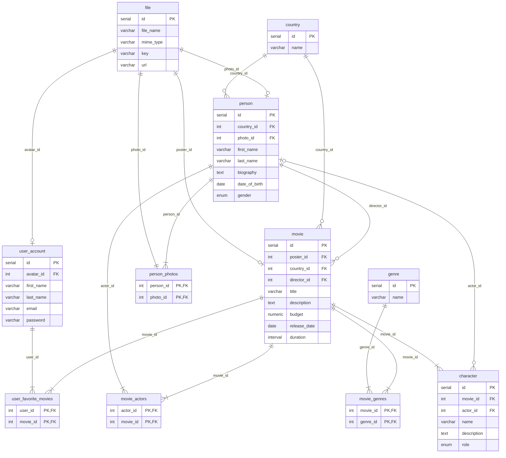

DataBase Design

Movie App

```mermaid
erDiagram

file{
    serial id PK
    varchar file_name
    varchar mime_type
    varchar key
    varchar url
}

country{
    serial id PK
    varchar name
}

user_account{
    serial id PK
    int avatar_id FK
    varchar first_name
    varchar last_name
    varchar email
    varchar password
}

person{
    serial id PK
    int country_id FK
    int photo_id FK
    varchar first_name
    varchar last_name
    text biography
    date date_of_birth
    enum gender
}

movie{
    serial id PK
    int poster_id FK
    int country_id FK
    int director_id FK
    varchar title
    text description
    numeric budget
    date release_date
    interval duration
}

character{
    serial id PK
    int movie_id FK
    int actor_id FK
    varchar name
    text description
    enum role
}

person_photos{
    int person_id PK, FK
    int photo_id PK, FK
}

movie_genres{
    int movie_id PK,FK
    int genre_id PK,FK
}
genre{
    serial id PK
    varchar name
}

movie_actors{
    int actor_id PK,FK
    int movie_id PK,FK
}

user_favorite_movies{
    int user_id PK,FK
    int movie_id PK,FK
}

file ||--o| user_account : avatar_id
country ||--o{ person : country_id
file ||--o| person: photo_id
file ||--o| movie: poster_id
country ||--o{ movie: country_id
person ||--o{ movie: director_id
movie ||--|{ character: movie_id
person |o--o{ character: actor_id
file ||--|| person_photos: photo_id
person ||--|{ person_photos: person_id
genre ||--|{ movie_genres: genre_id
movie ||--|{ movie_genres: movie_id
person||--|{ movie_actors: actor_id
movie ||--|{ movie_actors: movie_id
user_account ||--|{ user_favorite_movies: user_id
movie ||--|{ user_favorite_movies: movie_id
```
